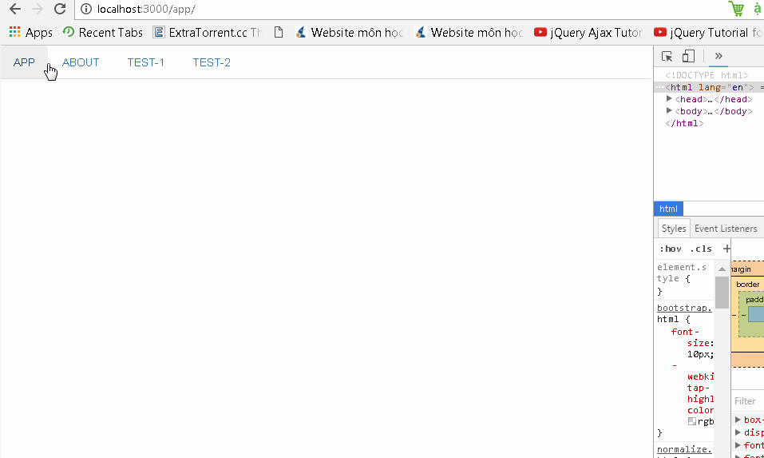

# Seminar-UDPT - *Tên đề tài*

**Tên đề tài** là một repository trong đề tài tìm hiểu của lớp Ứng dụng phân tán.

Thành viên:
* [x] **1312415** Tên sinh viên 1 (tên tài khoản github)
* [ ] **MSSV2** Tên sinh viên 2 (tên tài khoản github)

URL: **Link github page**

## Yêu cầu

Sinh viên check vào các mục bên dưới và ghi mã sinh viên đã làm vào chức năng theo mẫu. Mục nào ko có MSSV là tính điểm theo nhóm. Cần sắp xếp các chức năng bên dưới theo thứ tự MSSV đã thực hiện.

Yêu cầu **GIT**
* [x] Có sử dụng GIT.
* [x] Sử dụng GIT theo Centralized Workflow.
* [x] Sử dụng GIT theo Feature Branch Workflow.
* [ ] Sử dụng GIT theo Gitflow Workflow.

Yêu cầu **bắt buộc**
* [x] Source code demo
* [x] Slide thuyết trình
* [x] Tạo github page để viết lại báo cáo cho nội dung đề tài tìm hiểu (WIKI)

Các **nội dung lý thuyết** dự định tìm hiểu. Nhóm liệt kê các nội dung đã làm được vào bên dưới và check vào các nội dung đã tìm hiểu được.
* [x] Tìm hiểu về React Component
* [x] Tìm hiểu về React Router
* [x] Tìm hiểu về kiến trúc Flux

Các **chức năng của demo** đã thực hiện hoặc dự kiến thực hiện. Nhóm check vào các chức năng đã làm
* [x] Demo 1 tạo 1 component đơn giản mà không cần node
* [x] Demo 2 Tạo 1 TodoList dùng react
* [x] Demo 3 Tạo 1 TodoList dùng react có sử dụng kiến trúc Flux
* [x] Demo 4 Tạo 1 App cho biết profile của user trên github có sử dụng React, Flux, React-router để phân trang
## Demo

Link ảnh GIF demo ứng dụng:

Tạo ảnh GIF với chương trình [LiceCap](http://www.cockos.com/licecap/).

## License

    Copyright [yyyy] [name of copyright owner]

    Licensed under the Apache License, Version 2.0 (the "License");
    you may not use this file except in compliance with the License.
    You may obtain a copy of the License at

        http://www.apache.org/licenses/LICENSE-2.0

    Unless required by applicable law or agreed to in writing, software
    distributed under the License is distributed on an "AS IS" BASIS,
    WITHOUT WARRANTIES OR CONDITIONS OF ANY KIND, either express or implied.
    See the License for the specific language governing permissions and
    limitations under the License.
